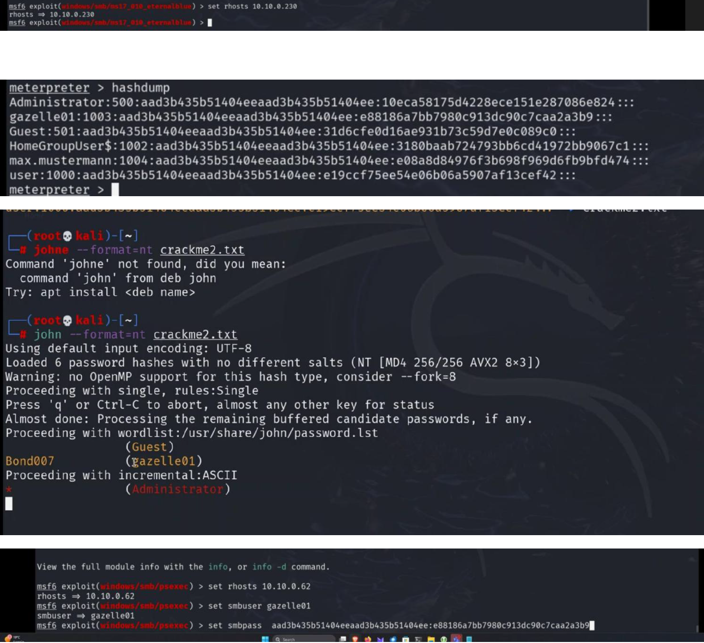

scan network for vuln server:

grab msfconsole and select exploit.

once connected us hashdump in meterpretershell to dump pw hashes.

crack hashes with john

search for exploit smb/psexec
	smbuser <vuln user where we have nt hash>
	smbpass <nt hash>

