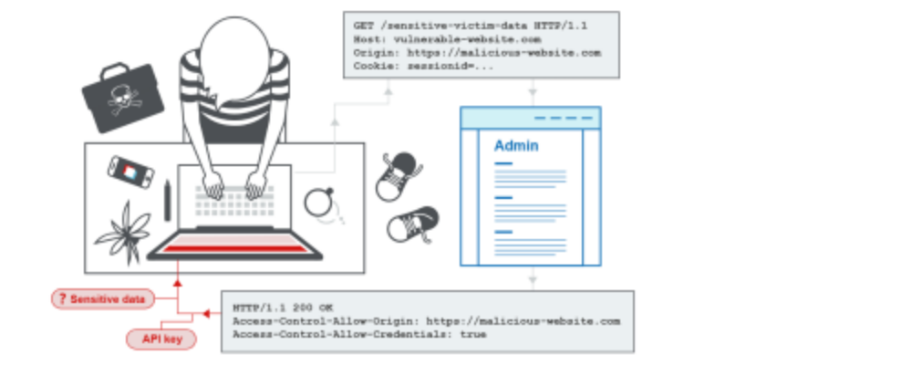
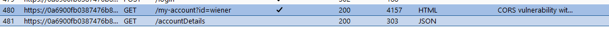
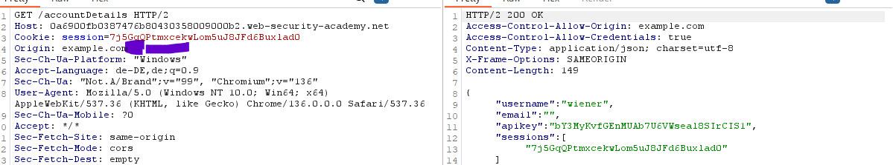

Login and check how your api key / data is beeing generated:

Check how u receive the data - here with a get to /accountDetails

Send to repeater and try to add the Origin header and see if still works to see if vuln.

1, Origin: whatever.com
2l Origin: null
3. try subdomains
If we see in Access-Control-Allow-Origin the website its vuln to all
	-> Basic
If we see null
	-> CORS:NULL
otherwise:
	-> CORS:subdomains

