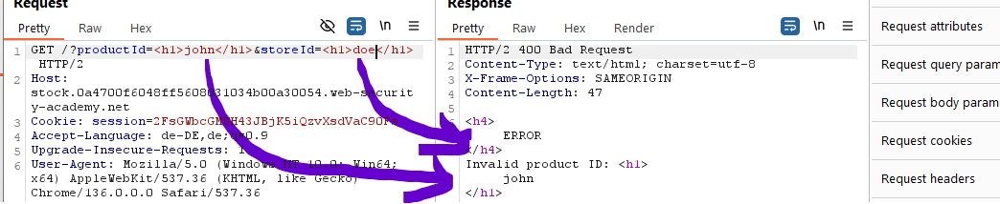
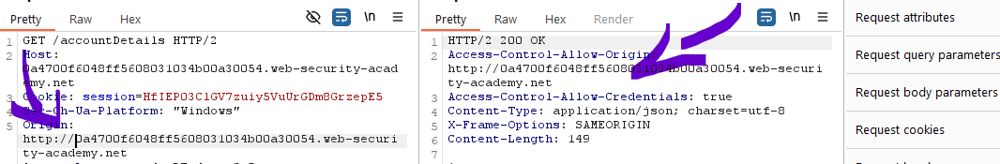
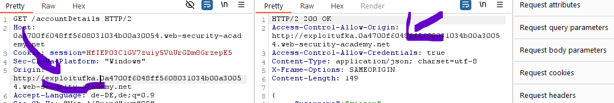

This is a chain of a XSS into http tls break subdomain cors:

1. find xss vuln.
	Test both parameters - john shows so first is vuln to xss

2. Find cors vuln:
	nothing worked, not any, not null, not even same page

3. But with http it worrks!!

4. Also http hosted on any site and just checks parameters after.

5. Write script again:

But now since we cant call it directly we have to put the exploit withing another script that actually calls the unsafe http side and pass script 1 as parameter for the XSS.
also make sure to url encode:

