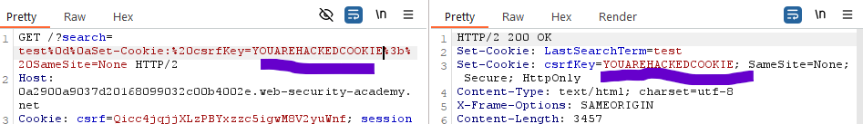

In some cases both CSFR Token and CSFRKey(cookie) are equal and the server only checks for correct format / if they are same

To perform this attack we still need to be able to inject a cookie with
	HTTP HEADER INJECTION - required
		but it doesnt need to be a valid one.

Test by entering random values both same tho -> still works. we good

Search for vulnerable endpoint that allows you to set cookies:

Also always make sure to doublecheck what exactly the cookie name is:
it can be csrfKey or just csfr - it has to match:

searchitem%0d%0aSet-Cookie:%20csrf=YOUAREHACKEDCOOKIE%3b%20SameSite=None

Write exploit script:

