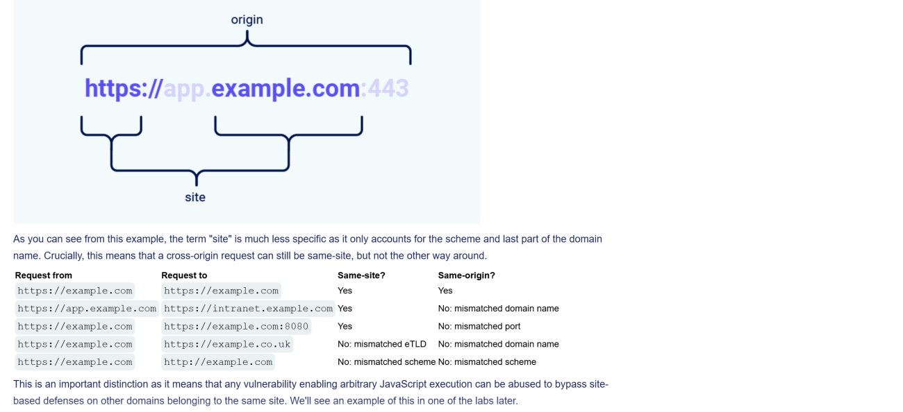

Difference Same Site vs Same origin:

Same Site Cookie restriction levels:
	- Strict
			Only when its exactly from the same site -> otherwise it wont be sent
	- Lax
			Only in GET method and CLICK
			NOT in POST (usually to modify data) aswell as iframes, scripts references to images etc
	- None
			Basically disables Same Site Cookie restrictions

Default goes to Lax -> some but not all.

Can be set manually:
- Set-Cookie: session=0F8tgdOhi9ynR1M9wa3ODa; SameSite=Strict
-
If you set it none you need also set Secure (https only) or it will be ignored
- Set-Cookie: trackingId=0F8tgdOhi9ynR1M9wa3ODa; SameSite=None; Secure

