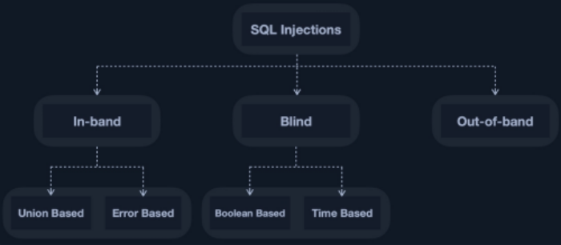

Types:

Inband:
Output direkt am Frontend wieder

Blind:
We dont get output “printed” but to test if it gets processed we can verify with boolean to see if its same or not
or Sleep() and wtch if delay.

Out-of-band:
Transferring the output f.e. to a DNS server and getting Data from there.

