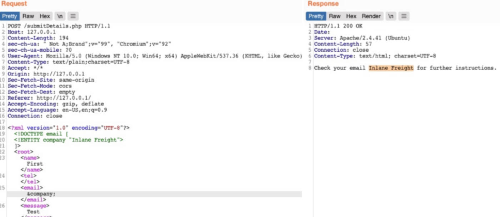

Finding possible vuln. looking burp and checking if we can insert and call entities - if it displays its vuln else it will display &company;

php server:

vi index.php

quick test: -> &company; nicht vergessen unten

Klassiker für pwd entity.

Most files have special characters “<” “>” “?” “”" and break to prevent use php wrapper for base64:

1. look for ssh keys, or windows hashes

2. shell:

use curl command to download our shell:

make sure to actually replace “ ” with  $IFS

3. Use php filters:

4. Other Filter(wraper)
	but last line needs to come from external so us ->

5. Using Errors:
Just like in last host:

Inject in Burp:

6. File Extraction using XXE

Can also encrpyt it and send it as variable
(waiting shell explained under file_transfer -> php_rev_shell)

even crazier:
In addition to storing our base64 encoded data as a parameter to our URL, we may utilize DNS OOB Exfiltration by placing the encoded data as a sub-domain for our URL (e.g. ENCODEDTEXT.our.website.com), and then use a tool like tcpdump to capture any incoming traffic and decode the sub-domain string to get the data. Granted, this method is more advanced and requires more effort to exfiltrate data through.

