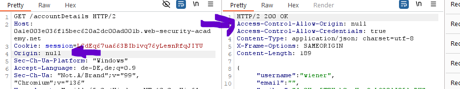

### Whitelisted null origin value
The Origin header supports the value `null`. Browsers might send `null` in the Origin header in unusual situations:

- Cross-origin redirects
- Requests from serialized data
- Requests using the `file:` protocol
- Sandboxed cross-origin requests


### Pack it in an iframe

```text
sandbox = permissions
allow-forms: code is inside a form inside a script inside a webpage
allow-scripts: because it is a script
allow-top-navigation: change direction when the page loads
srcdoc: send code inside a document as malicious code (HTML-encoded)
```


