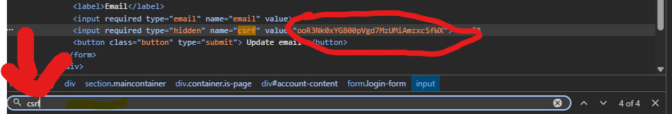
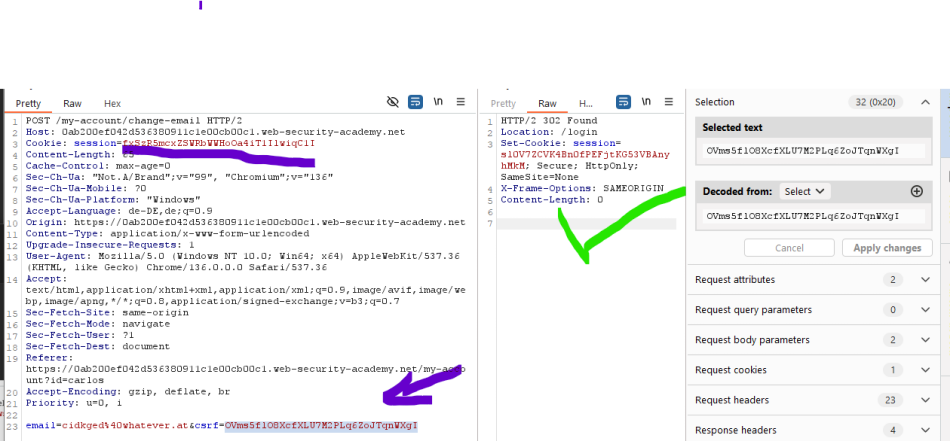

All you need is a valid CSRF token and the session token of the user you want to target, because they are not linked.

Find a valid CSRF token in the browser.

### Copy the CSRF token
Use it to change the email of a different session (other account) and test it.

Write a script if needed, but note that CSRF tokens are often one-time use. Each request may require logging in again and grabbing a fresh token.

