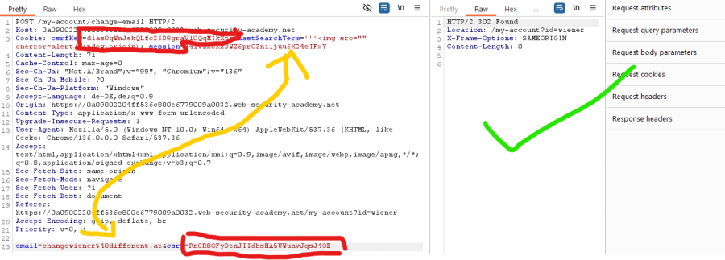
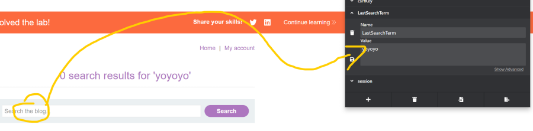

Extra header that ties the CSRF token to a cookie (not necessarily the session cookie). Email change is dependent on the CSRF token.

Harder to exploit, but possible. You need to be able to set a session cookie in the victim browser (e.g., via XSS).

High-level flow:
1. Log in with your account and get a CSRF token + session cookie.
2. Set your session cookie in the victim browser.
3. Set the header with your session and CSRF key.
4. Feed the victim token to change the email.

Side note: cookies often apply to an entire DNS zone (all subdomains), so setting or changing them can be viable across the domain.

Attack:
1. Check whether the CSRF token is tied to the CSRF cookie.
   - Submit an invalid CSRF token.
   - Submit a valid CSRF token from a different user (use a different browser or incognito).
2. Submit a valid CSRF token and CSRF cookie (attacker) with a different session cookie (victim).

### Grabbing the csrfKey (under cookies)

```text
attacker: csrf-token: RnGR8OFyDtnJIIdhsHA5UWunvJqsJ4OE CSRFKEY-(session): dlas0qWnJekQLfc26D9graV10QqMIkXp
```

So you can change the email of a user because it is bound to the session cookie by using two CSRFs.

### What we need to be able to do
1. Inject a csrfKey cookie in the user's session (HTTP header injection).
2. Send a CSRF attack to the victim with a known CSRF token.

Find a vulnerability for HTTP header injection: the last searched item goes into the cookies.

Write a payload: the new part is the HTTP header injection, the rest is basically the same as the others.




