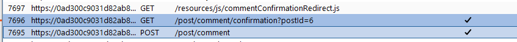
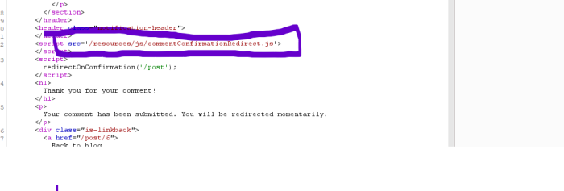
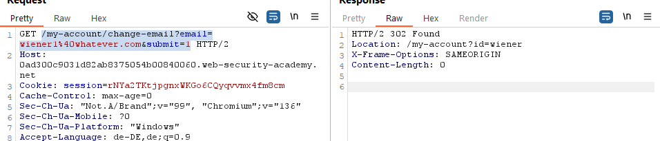

Bypassing SameSite restrictions using on-site gadgets

As far as browsers are concerened, client side redirects aren't redirects at all So it's always a same side redirect and will include all cookies. Doesn't work itf its server side -> browser recognizes it on follow and the restrictions apply.

### So what we essentially are looking for are redirects f.e: comments

### We find posting a comment redirects us: looking at burp we find

### Looking at the request we can see javascript code

Looking at the code we see how the redirect  is buuult and that it depends on a controllable parameter ("postID");

But since its a redirect from here with the given parameter we try it in browser, and not burp. /post/comment/confirmation?postId=

Got 404 - cause we still have /post before /my-account but generally worked

Need to use patah traversel with../ and also append the other parameters from a GET request to change the email: /my-account/change-email?email=wiener1%40whatever.com&submit=1

We also need to make sure the &submit=1 is url encoded

I usually just urlencode everything after the = to be safe: Just make sure go step by step andd check it still works, also always make sure to actually use the redirect and not FQDM [https://0ad300c9031d82ab8375054b00840060.web-security-academy.net/post/comment/confirmation?postId=../my-account/change-email?email=noclue%40whatever.com%26submit=1](https://0ad300c9031d82ab8375054b00840060.web-security-academy.net//post/comment/confirmation?postId=../my-account/change-email?email=noclue%40whatever.com%26submit=1) "

### Write script

