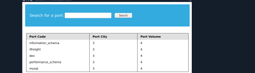

Every Database has the database: INFORMATION_SCHEMA which stores metadata.

Other Tables within a DB can be called with DATABASE.ELEMENT INFORMATION_SCHEMA.SCHEMATA enthält alle Datenbanken.

'UNION dsd

with database() i get to see which db the web app. is using.

TABLE_NAME, TABLE_SCHMA from INORMATION_SCHEMA.TABLES to get the Tables and the database they are linked to.

### See the Columns

### See the data

### Privaleges

database

