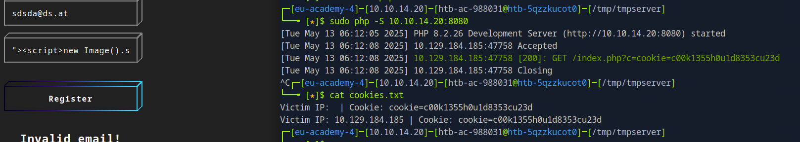

$cd /tmp/tmpserver $ sudo php -S 0.0.0.0:80

Herausfinden welches Feld vulnerable ist: Verschiedene Payloads einfüggen und identifier einfügen -> am get request sieht man dann welches es war.

Php code for cookie grabbing. einfügen. in index.php

Server Starten.

### Ins XSS Vulnerable field jetzt mit local ip+port und der vulnerability das new image script für cookie einfügen

